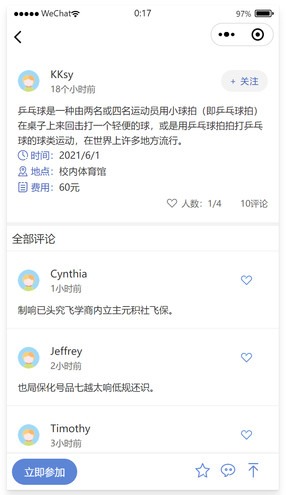

# 凑凑
提高组局效率


# Lin UI

使用[Lin UI](https://doc.mini.talelin.com/start/)组件来搭建主要界面

1. 安装模块

   ```shell
   npm install
   ```

   点击**工具**选项，选择**构建npm**，生成**miniprogram_npm**文件夹

2. 配置中引入

   ```json
   {
   	"usingComponents":{
    	"l-button":"/miniprogram_npm/lin-ui/button/index"
   }
   ```

3. 页面中使用

   ```html
   <l-button type="default">默认按钮</l-button>
   ```

4. 项目配置勾选 **增强编译**

   

# Mock

使用[Mock](http://mockjs.com/examples.html)来模拟评论区数据

调试器面板选中Mock

<figure>
    
</figure>

导入根目录下的**mock.config.json**


# V 1.0

完成进度：首页页面和房间页面

<figure>
    
</figure>


# v 1.0.1

讨论区页面

<figure>
    
</figure>


